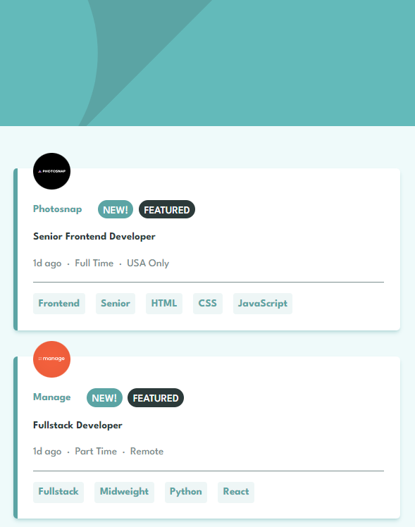

# Frontend Mentor - Job listings with filtering solution

This is a solution to the [Job listings with filtering challenge on Frontend Mentor](https://www.frontendmentor.io/challenges/job-listings-with-filtering-ivstIPCt). Frontend Mentor challenges help you improve your coding skills by building realistic projects.

## Table of contents

- [Frontend Mentor - Job listings with filtering solution](#frontend-mentor---job-listings-with-filtering-solution)
  - [Table of contents](#table-of-contents)
  - [Overview](#overview)
    - [The challenge](#the-challenge)
    - [Screenshot](#screenshot)
    - [Links](#links)
  - [My process](#my-process)
    - [Built with](#built-with)
    - [What I learned](#what-i-learned)
    - [Continued development](#continued-development)
  - [Author](#author)
  - [Acknowledgments](#acknowledgments)

**Note: Delete this note and update the table of contents based on what sections you keep.**

## Overview

### The challenge

Users should be able to:

- View the optimal layout for the site depending on their device's screen size
- See hover states for all interactive elements on the page
- Filter job listings based on the categories

### Screenshot

### Links

- Solution URL: [https://www.frontendmentor.io/solutions/job-listings-using-vue3-typescript-tailwind-css-and-vitejs-vEfu83uR_Y](https://www.frontendmentor.io/solutions/job-listings-using-vue3-typescript-tailwind-css-and-vitejs-vEfu83uR_Y)
- Live Site URL: [https://ap2soft.github.io/frontendmentor-job-listings/](https://ap2soft.github.io/frontendmentor-job-listings/)

## My process

### Built with

- Mobile-first workflow
- [Vue3](https://vuejs.org/) - The Progressive JavaScript Framework
- [TypeScript](https://www.typescriptlang.org/) - JavaScript with syntax for types
- [Tailwind CSS](https://tailwindcss.com) - A utility-first CSS framework
- [Vite](https://vitejs.dev/) - Next Generation Frontend Tooling (to build the project)
- [Netlify](https://netlify.com) - Webiste deployment

### What I learned

I learned basics of TypeScript, how to type things, as well as using it with Vue3.

### Continued development

I'm going to keep using TypeScript and Vue3 to get better with it.

## Author

- Website - [Andrew](https://ap2.dev)
- Twitter - [@andreich1980](https://www.twitter.com/andreich1980)

## Acknowledgments

Huge shout-out to my friend [@redos7](https://github.com/redos7) for code reviews and JavaScript best practices tips.
